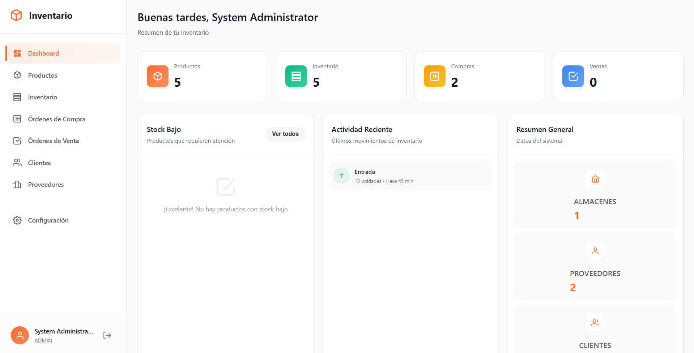

<div align="center">

# 🎯 Inventia - Página de Descarga

### Sistema de Gestión de Inventario Desktop

[](https://astro.build)
[](https://www.typescriptlang.org/)
[](https://tailwindcss.com)
[](https://react.dev)




</div>

---

## 📖 Descripción

Landing page moderna y responsive para **Inventia**, una aplicación de escritorio (Electron) para gestión integral de inventarios. Incluye descarga directa del instalador, características detalladas y documentación de instalación.

### 🎯 Propósito

- Presentar las características de Inventia
- Facilitar la descarga e instalación de la aplicación
- Mostrar las capacidades del sistema de inventario
- Proporcionar información técnica y requisitos del sistema

---

## ✨ Características Principales

### 🛠️ Stack Tecnológico

- **Astro 5.14.5** - Framework estático ultrarrápido
- **TypeScript** - Tipado estático para mayor seguridad
- **Tailwind CSS 4** - Estilos utility-first modernos
- **React 19** - Componentes interactivos
- **shadcn/ui** - Biblioteca de componentes UI de alta calidad

### 🎨 Características del Sitio

- ✅ **Diseño Responsivo** - Adaptado a móviles, tablets y desktop
- ✅ **Modo Oscuro** - Sistema de temas con `astro-themes`
- ✅ **Animaciones Fluidas** - Transiciones suaves con Motion
- ✅ **SEO Optimizado** - Metadatos y Open Graph configurados
- ✅ **Descarga Directa** - Enlace a GitHub Releases
- ✅ **Documentación Clara** - Guía de instalación paso a paso

### 📦 Secciones Incluidas

1. **Hero** - Presentación principal con call-to-action
2. **Features** - 3 características clave con imágenes
3. **App Features** - Grid de 12 funcionalidades detalladas
4. **Download Section** - Instrucciones y requisitos del sistema

---

## 🚀 Inicio Rápido

### Prerrequisitos

- Node.js 18+ instalado
- npm o pnpm

### Instalación


```bash
# Clonar el repositorio
git clone https://github.com/CarlosMartinezDev20/Inventia.git
cd mainline-astro-template

# Instalar dependencias
npm install

# Iniciar servidor de desarrollo
npm run dev
```

El sitio estará disponible en [http://localhost:4321](http://localhost:4321)

### Comandos Disponibles

```bash
npm run dev          # Servidor de desarrollo
npm run build        # Build de producción
npm run preview      # Preview del build
npm run astro        # CLI de Astro
```

---

## 📁 Estructura del Proyecto

```
mainline-astro-template/
├── src/
│   ├── components/
│   │   └── blocks/
│   │       ├── hero.tsx              # Hero principal
│   │       ├── features.tsx          # Características con imágenes
│   │       ├── app-features.tsx      # Grid de funcionalidades
│   │       ├── download-section.tsx  # Sección de descarga
│   │       ├── navbar.tsx            # Barra de navegación
│   │       └── footer.tsx            # Footer
│   ├── pages/
│   │   └── index.astro               # Página principal
│   ├── styles/                       # Estilos globales
│   └── consts.ts                     # Configuración y constantes
├── public/
│   ├── features/                     # Imágenes de características
│   └── og-image.jpg                  # Open Graph image
└── README.md
```

---

## ⚙️ Configuración

### URLs Importantes

Edita `src/consts.ts` para cambiar:

```typescript
export const SITE_TITLE = "Inventia - Sistema de Gestión de Inventario";
export const DOWNLOAD_URL = "https://github.com/.../Inventia-Setup-1.0.0.exe";
export const GITHUB_URL = "https://github.com/CarlosMartinezDev20/Inventia";
```

### Componentes Principales

- **Hero**: `src/components/blocks/hero.tsx`
- **Features**: `src/components/blocks/features.tsx`
- **Download**: `src/components/blocks/download-section.tsx`

---

## 🌐 Deployment

### Vercel (Recomendado)

1. Conecta tu repositorio a [Vercel](https://vercel.com)
2. Configuración automática detectada para Astro
3. Deploy automático en cada push a `main`

**Configuración:**
- **Framework Preset**: Astro
- **Build Command**: `npm run build`
- **Output Directory**: `dist`

### Otras Plataformas

Compatible con:
- Netlify
- Cloudflare Pages
- GitHub Pages
- Railway

---

## 📦 App de Inventario

### Características de Inventia

- 📊 **Dashboard Analytics** - Métricas en tiempo real
- 📦 **Gestión de Productos** - CRUD completo con imágenes
- 🏪 **Multi-Almacén** - Manejo de múltiples ubicaciones
- 🛒 **Órdenes Inteligentes** - Compra y venta automatizadas
- 👥 **CRM Integrado** - Clientes y proveedores
- 📈 **Reportes Avanzados** - Exportación PDF/Excel
- 🔐 **Roles y Permisos** - Control de acceso granular
- 🔔 **Notificaciones** - Alertas de stock y actividad
- 🎨 **UI Moderna** - Interfaz intuitiva y responsive
- ☁️ **Backend en la Nube** - Sincronización automática
- 🔌 **API REST** - Integración con otros sistemas
- ⚙️ **Configuración Flexible** - Personalización completa

### Stack Técnico de la App

- **Frontend**: Electron + HTML/CSS/JavaScript
- **Backend**: NestJS + Prisma + PostgreSQL
- **Hosting**: Render (Backend) + GitHub Releases (App)
- **Monitoring**: UptimeRobot (Keep-alive 24/7)

---

## 🤝 Contribuciones

Este proyecto está basado en el template **Mainline Astro Template** y ha sido personalizado para Inventia.

### Créditos Originales

- Template por [shadcnblocks.com](https://shadcnblocks.com)
- Diseño por [Callum Flack](https://x.com/callumflack)
- Desarrollo por [Yassine Zaanouni](https://x.com/YassineZaanouni)
- Producción por [Rob Austin](https://x.com/ausrobdev)

### Personalización para Inventia

- Adaptación y customización por **Carlos Martínez**
- Backend API por **carlos200518mar-beep**

---

## 📄 Licencia

Este proyecto utiliza componentes de código abierto. Ver el template original para más detalles.


<div align="center">

**⭐ Si te gusta el proyecto, dale una estrella en GitHub ⭐**

